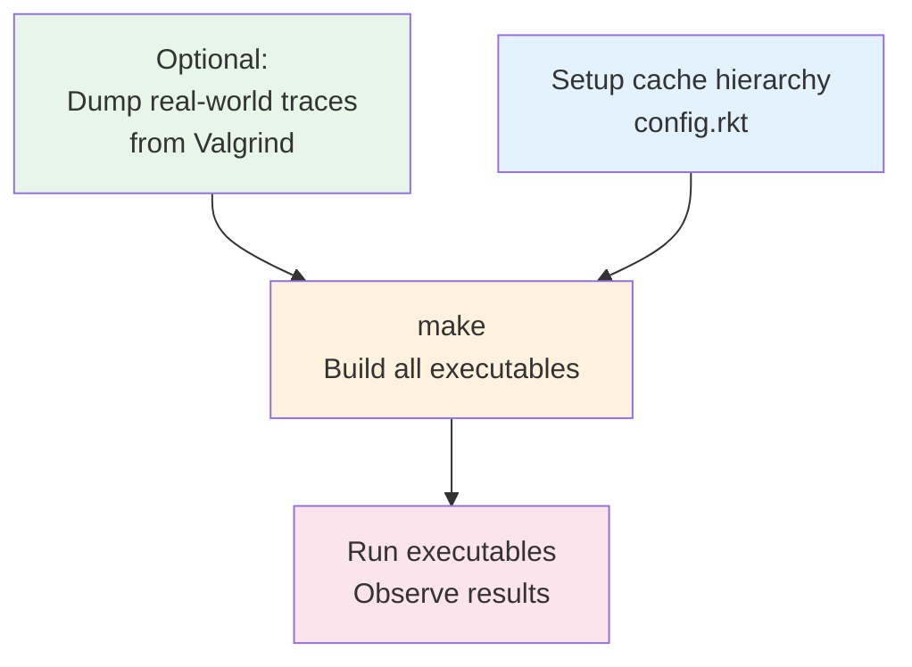

# Stratum


**A high-performance architectural exploration framework designed for rapid cache hierarchy evaluation.**

Stratum leverages **C++20 template metaprogramming** to model memory hierarchies with static binding, eliminating virtual dispatch overhead ("Zero-Overhead"). This approach mirrors actual hardware instantiation—where cache topology is fixed at synthesis time—allowing architects to validate configurations and replacement policies with maximum simulation throughput.

## Why Stratum? (So What?)

**This project demonstrates:**

1. **Deep understanding of cache locality principles** - Not just implementing a cache simulator, but understanding _why_ certain data structures (arrays vs linked lists) matter for real hardware performance.

2. **Software architecture patterns in systems programming** - Using the Strategy pattern via C++ templates to achieve zero-overhead abstraction, proving that good design doesn't require runtime costs.

3. **Metaprogramming as a productivity tool** - Leveraging Racket to generate type-safe C++ code, showing familiarity with multi-language toolchains common in hardware/compiler development.

**The "So What" Answer:** This isn't just a cache simulator—it's a case study in applying software engineering principles to performance-critical systems, where every pointer dereference and virtual call matters.

## Design Philosophy & Architectural Alignment

**Static Topology Resolution (Zero-Overhead Abstraction):**  
By using C++ templates (`Cache<L1, L2...>`), the entire hierarchy traversal is resolved at compile-time. This mimics the physical connections in RTL, resulting in simulation speeds significantly faster than traditional runtime-configurable simulators (like gem5's polymorphic objects) for fixed-topology studies.

**Generator-Based Workflow (Why Racket?):**  
Racket serves as a **configuration DSL compiler**. Instead of writing repetitive C++ boilerplate for each cache configuration, we define hierarchies as S-expressions and generate type-safe code automatically. This mirrors modern hardware construction languages (HCLs) like Chisel, where:

- **Specification** (what you want) is separate from **implementation** (how it's built)
- Racket's homoiconicity (code-as-data) makes AST manipulation trivial
- Pattern matching and quasiquoting eliminate string concatenation hell

**Example:** Changing from 3-level to 2-level hierarchy requires editing 3 lines in `config.rkt`, not rewriting C++ templates.

**Deterministic Latency Modeling:**  
Provides trace-driven analysis to evaluate the impact of cache geometry (Sets/Ways) and policies (LRU/FIFO) on Average Memory Access Time (AMAT).

## Features

**Type-Safe Hierarchy Construction:** The compiler ensures the validity of the memory hierarchy configuration at compile-time.

**Modular Replacement Policies:** Strategy pattern implemented via templates (LRU, FIFO, Random) allows easy injection of new algorithms (e.g., RRIP) without performance penalty.

**Latency-Based Performance Analysis:** Detailed breakdown of Hits, Misses, and accumulated latency penalties at each level.

**Valgrind Integration:** Seamless workflow to capture traces from real-world binaries (SPEC CPU, etc.) in lackey format.

## Performance Characteristics & Limitations

**What This Simulator Optimizes For:**

- **Compile-time hierarchy resolution** - No virtual dispatch, no runtime configuration overhead
- **Deterministic trace replay** - Perfect for A/B testing different cache configurations
- **Fast iteration** - Racket codegen + C++ templates = rapid prototyping

**Known Trade-offs (Honest Assessment):**

1. **LRU Policy Implementation (Cache-Friendly Design):**

   - Uses **flattened timestamp array** (`std::vector<uint64_t>`) instead of linked lists
   - **Why this matters:** Contiguous memory layout enables CPU prefetching during victim selection
   - **Trade-off:** O(ways) linear scan to find LRU victim vs O(1) with linked list move-to-front
   - **Why it's better:** For typical associativity (8-16 ways), the linear scan is faster than pointer chasing due to cache locality
   - **Design insight:** Mimics hardware LRU counters (per-way timestamps) rather than software data structures

2. **Fixed Topology at Compile-Time:**

   - **Limitation:** Cannot simulate mesh/NoC topologies without recompilation
   - **Why it's acceptable:** Targets pre-silicon validation where hierarchy is already decided
   - **Future work:** Hybrid approach (templates for local hierarchy + runtime routing)

3. **Memory Footprint:**
   - Each cache set stores full tag arrays (not compressed)
   - **Trade-off:** Simplicity and correctness over memory efficiency
   - **Acceptable for:** Simulating realistic cache sizes (up to L3) on modern workstations

**Philosophy:** This simulator prioritizes _clarity of implementation_ and _ease of experimentation_ over absolute simulation throughput. For production-grade performance modeling, consider gem5 or ZSim.

## Workflow Overview



## Quick Start

### Prerequisites

- **C++20 compiler** (GCC 11+, Clang 12+)
- **CMake 3.10+**
- **Racket 8.0+** (optional, for C++ code generation)
- **Valgrind** (optional, for custom traces)

### Build and Run (30 seconds)

```bash
git clone https://github.com/TheCloudlet/Stratum.git && cd Stratum
cmake -B build -DCMAKE_BUILD_TYPE=Release && cmake --build build
./build/bin/stratum
```

### Expected Output

```
=========================================================
Running Simulation: Sequential (/path/to/sequential.txt)
=========================================================

=== Simulation Results (Aggregated) ===
Level                 Hits     Misses    Avg Latency (cyc)
L1                    4375        625                    4
L2                       0        625                    0
L3                       0        625                    0
MainMemory             625          0                  232
```

## Advanced Usage

### 1. Custom Cache Configurations

Edit `scripts/config.rkt` to define your experiments:

```racket
;; Compare 3-level vs 2-level hierarchy
(case_001
  (L1 64 8 4 LRUPolicy L2)
  (L2 512 8 64 LRUPolicy L3)
  (L3 8192 16 64 LRUPolicy MainMemory))

(case_002
  (L1 64 8 4 LRUPolicy L2)
  (L2 512 8 64 LRUPolicy MainMemory))  ;; Skip L3
```

**Available Policies:** `LRUPolicy`, `FIFOPolicy`, `RandomPolicy`

**Rebuild and compare:**

```bash
racket scripts/config.rkt  # Regenerate C++ code
cmake --build build
./build/bin/case_001 > results_3level.txt
./build/bin/case_002 > results_2level.txt
diff results_3level.txt results_2level.txt
```

### 2. Real-World Traces with Valgrind

**Step 1: Capture trace from your program**

```bash
valgrind --tool=lackey --trace-mem=yes ./your_program 2>&1 | \
  perl -ne 'BEGIN{print "# Type  Addr\n"} \
           if(/^ ([LSM])\s+0x([0-9a-fA-F]+)/){ \
             $addr=hex($2); \
             $aligned=int($addr/64)*64; \
             $type=($1 eq "M")?"S":$1; \
             printf "%s       0x%X\n",$type,$aligned \
           }' > test/data/my_trace.txt
```

Or use the provided script:

```bash
./scripts/convert_lackey.sh lackey.log test/data/my_trace.txt
```

**Step 2: Add trace to `config.rkt`**

```racket
(define traces
  '(("Sequential" "sequential.txt")
    ("MyWorkload" "my_trace.txt")))  ;; Add your trace
```

**Step 3: Rebuild and run**

```bash
racket scripts/config.rkt && cmake --build build
./build/bin/case_001  # Now includes "MyWorkload" results
```

### 3. Manual C++ Configuration (No Racket)

For one-off experiments, edit `src/main.cpp` directly:

```cpp
using MemType = MainMemory<"MainMemory">;
using L2Type = Cache<"L2", MemType, 512,  8, 64, LRUPolicy,    10>;
using L1Type = Cache<"L1",  L2Type,  64,  8, 64, LRUPolicy,    4>;
//                     ^     ^       ^    ^   ^         ^      ^
//                  Name NextLayer Sets Ways BlockSize Policy HitLatency

RunTraceSimulation<L1Type>("Test", "trace.txt", {"L1", "L2", "MainMemory"});
```

## Included Test Traces

Six synthetic workloads in `test/data/`:

| Trace            | Pattern                    | Expected Behavior               |
| ---------------- | -------------------------- | ------------------------------- |
| `sequential.txt` | Streaming (stride=64B)     | 0% hit rate (compulsory misses) |
| `temporal.txt`   | Hot working set (5 blocks) | ~100% hit rate                  |
| `spatial.txt`    | Sequential words in block  | 87.5% hit rate                  |
| `random.txt`     | Uniform random             | ~0% hit rate                    |
| `largeloop.txt`  | 64KB loop (exceeds L1)     | L2 hits, L1 misses              |
| `gaussian.txt`   | Normal distribution        | Partial hits                    |

Generate new traces: `python scripts/gen_test_data.py`

## Project Structure

```
stratum/
├── include/stratum/
│   ├── cache_sim.hpp       # Core cache template & statistics
│   ├── policies.hpp        # Replacement policies (LRU, FIFO, Random)
│   ├── simulation.hpp      # Simulation runner & trace parser
│   └── trace_parser.hpp    # Trace file I/O
├── src/main.cpp            # Default configuration
├── scripts/
│   ├── config.rkt          # Racket DSL compiler
│   ├── convert_lackey.sh   # Valgrind trace converter
│   └── gen_test_data.py    # Synthetic trace generator
├── test/data/              # Benchmark traces
└── build/generated/        # Auto-generated C++ experiments
```

## Limitations

**Supported:**

- ✅ Hierarchical topologies (L1 → L2 → L3 → Memory)
- ✅ Private/shared cache configurations
- ✅ LRU, FIFO, Random replacement policies

**Not Supported:**

- ❌ Mesh/NoC topologies (requires runtime routing)
- ❌ Non-inclusive/NUCA caches
- ❌ Prefetchers (future work)

**Why?** The zero-overhead template approach requires compile-time topology resolution. Mesh networks need runtime routing, which would break the zero-abstraction guarantee.

## Use Cases

- **Pre-Silicon Validation**: Test cache configurations before RTL design
- **Research**: Compare replacement policies, sensitivity analysis
- **Education**: Teach cache concepts with observable behavior
- **Workload Analysis**: Profile real applications via Valgrind traces

## Contributing

Areas of interest:

- Additional replacement policies (PLRU, ARC, RRIP)
- Prefetcher models
- Multi-core simulation
- Power/energy modeling

Please ensure C++20 compliance and include unit tests.

## License

MIT License - see LICENSE file for details.

## Citation

```bibtex
@software{stratum2025,
  title={Stratum: A Zero-Overhead Cache Hierarchy Simulator},
  author={TheCloudlet},
  year={2025},
  url={https://github.com/TheCloudlet/Stratum}
}
```
