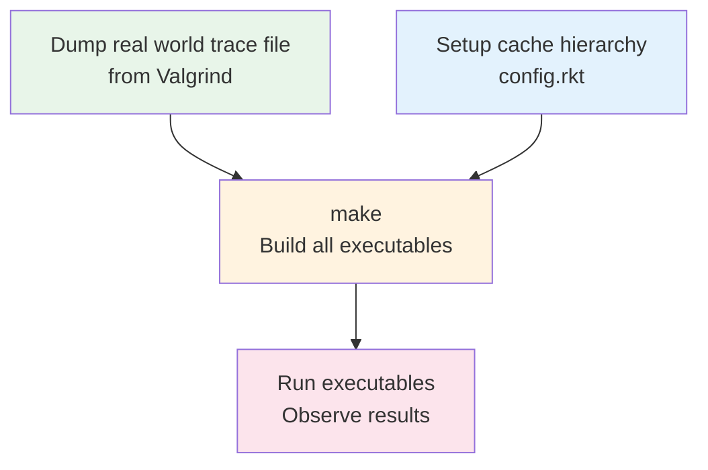
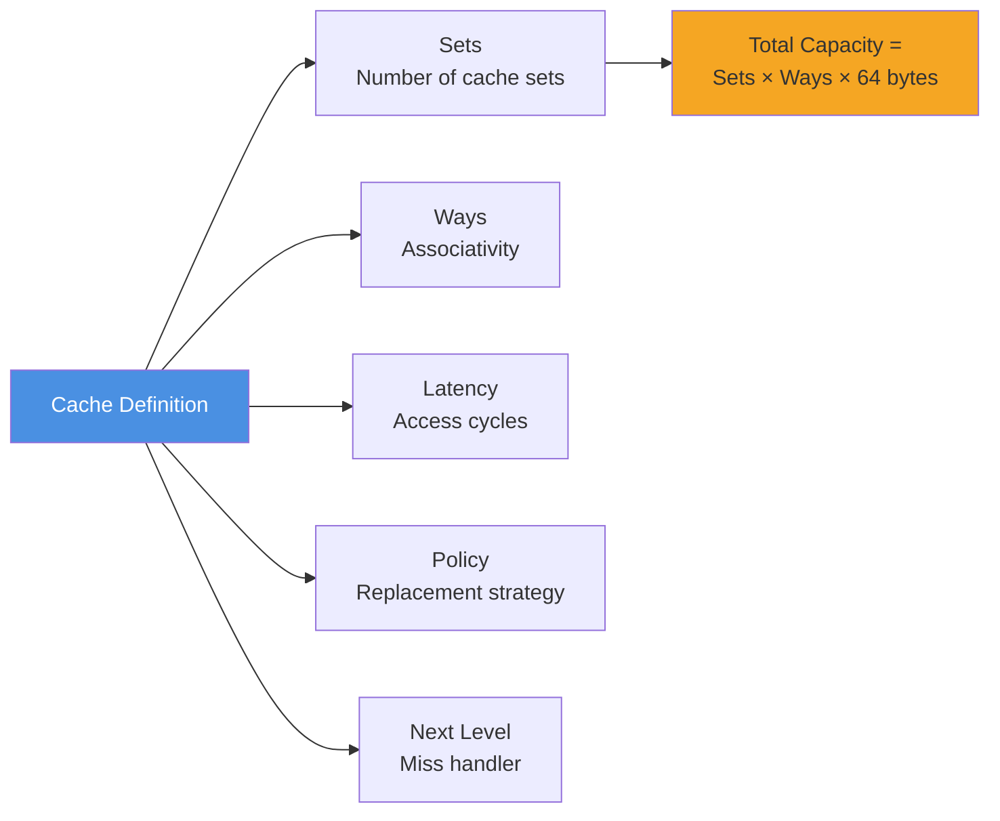
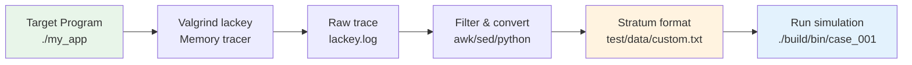
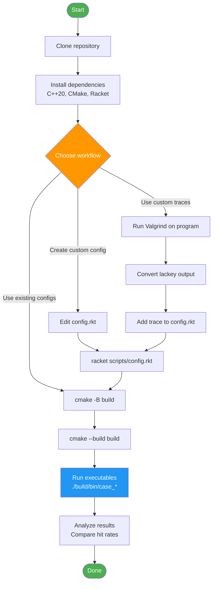

# Stratum


**A compile-time cache hierarchy simulator for hardware architects.**

Stratum is a zero-overhead, template-based cache simulator designed to help **computer architects rapidly explore and validate cache configurations** before committing to RTL implementation. Powered by Racket meta-programming and C++20 compile-time polymorphism, it enables fast iteration on cache hierarchies with deterministic, cycle-accurate simulation.

## Why Stratum?

Hardware architects face critical decisions when designing cache hierarchies:

- **What cache sizes optimize for my workload?** (32KB L1 vs 64KB?)
- **How many ways should I use?** (4-way vs 8-way associativity?)
- **What's the performance impact of different replacement policies?** (LRU vs FIFO vs Random?)
- **How does latency at each level affect overall performance?**

Stratum answers these questions **before tape-out** by:

1. **Rapid Configuration**: Define cache hierarchies in Racket, generate optimized C++ simulators automatically
2. **Zero Runtime Overhead**: Template metaprogramming eliminates virtual dispatch - hierarchy traversal is resolved at compile-time
3. **Deterministic Results**: Trace-driven simulation ensures reproducible performance analysis
4. **Rapid Configuration**: Define cache hierarchies in Racket, generate optimized C++ simulators automatically
5. **Deterministic Results**: Trace-driven simulation ensures reproducible performance analysis
6. **Easy Comparison**: Generate multiple configurations (case_001, case_002, ...) and compare results side-by-side

## Workflow Overview



**Note:** For step A, use this command to generate Valgrind traces:

```bash
valgrind --tool=lackey --trace-mem=yes ./your_program 2>&1 | \
  perl -ne 'BEGIN{print "# Type  Addr\n"} \
           if(/^ ([LSM])\s+0x([0-9a-fA-F]+)/){ \
             $addr=hex($2); \
             $aligned=int($addr/64)*64; \
             $type=($1 eq "M")?"S":$1; \
             printf "%s       0x%X\n",$type,$aligned \
           }' > test/data/my_trace.txt
```

## Quick Start

### Prerequisites

- **C++20 compiler** (GCC 11+, Clang 12+)
- **CMake 3.10+**
- **Racket 8.0+** (for generating custom configurations)
- **Valgrind** (optional, for generating custom traces)

### Build and Run

```bash
# Clone and build
git clone https://github.com/TheCloudlet/Stratum.git
cd Stratum
cmake -B build -DCMAKE_BUILD_TYPE=Release
cmake --build build

# Run the default simulation
./build/bin/stratum

# Run generated experiment configurations
./build/bin/case_001
./build/bin/case_002
```

### Expected Output

```
=========================================================
Running Simulation: Sequential (/path/to/sequential.txt)
=========================================================

=== Simulation Results (Aggregated) ===
Level                 Hits     Misses    Avg Latency (cyc)
L1                    4375        625                    4
L2                       0        625                    0
L3                       0        625                    0
MainMemory             625          0                  232
```

## Workflow 1: Configuration-Based Simulation

### Step 1: Define Cache Configurations

Edit [`scripts/config.rkt`](file:///Users/panyiping/EaglePlayground/stratum/scripts/config.rkt) to define your cache experiments:

```racket
;; Case 001: Standard 3-Level Hierarchy with LRU
(case_001
  ;; Name  Sets Ways Lat Policy      Next
  (L1      64   8    4   LRUPolicy   L2)
  (L2      512  8    64  LRUPolicy   L3)
  (L3      8192 16   64  LRUPolicy   MainMemory))

;; Case 002: Aggressive L1, skip L3
(case_002
  (L1      64   8    4   LRUPolicy   L2)
  (L2      512  8    64  LRUPolicy   MainMemory))

;; Case 003: Compare FIFO vs LRU (same geometry as case_001)
(case_003_fifo
  (L1      64   8    4   FIFOPolicy  L2)
  (L2      512  8    64  FIFOPolicy  L3)
  (L3      8192 16   64  FIFOPolicy  MainMemory))

;; Case 004: Random replacement baseline
(case_004_random
  (L1      64   8    4   RandomPolicy L2)
  (L2      512  8    64  RandomPolicy MainMemory))
```

**Available Policies:**

- `LRUPolicy` - Least Recently Used (timestamp-based, O(ways) scan)
- `FIFOPolicy` - First-In-First-Out (circular buffer)
- `RandomPolicy` - Random eviction (baseline for comparison)

**Cache Parameters:**



### Step 2: Generate Simulators

```bash
# Option 1: Manual generation
racket scripts/config.rkt
# Generates: build/generated/case_001.cpp, case_002.cpp, CMakeLists.txt

# Option 2: Auto-generate during build (Racket is auto-detected)
cmake -B build && cmake --build build
# Automatically runs config.rkt and builds all experiments
```

### Step 3: Run and Compare

```bash
# Compare cache geometries
./build/bin/case_001 > results_lru_3level.txt
./build/bin/case_002 > results_lru_2level.txt

# Compare replacement policies (same geometry, different policy)
./build/bin/case_001 > results_lru.txt
./build/bin/case_003_fifo > results_fifo.txt
./build/bin/case_004_random > results_random.txt

# Analyze differences
diff results_lru.txt results_fifo.txt
```

**Example Policy Comparison:**

```bash
# LRU vs FIFO on Temporal trace (high reuse)
grep "Temporal" results_lru.txt
# L1: 4995 hits (99.9% hit rate)

grep "Temporal" results_fifo.txt
# L1: ~4800 hits (96% hit rate - FIFO performs worse on temporal locality)
```

## Workflow 2: Custom Trace Generation with Valgrind

### Overview

Generate realistic memory access traces from actual programs using Valgrind's `lackey` tool:



### Step 1: Capture Memory Trace with Valgrind

```bash
# Run your program with Valgrind's lackey tool
valgrind --tool=lackey --trace-mem=yes ./your_program > lackey.log 2>&1

# Example output format from lackey:
#  I  0x400680,5      # Instruction fetch at 0x400680, 5 bytes
#  L  0x7ff000120,8   # Load from 0x7ff000120, 8 bytes
#  S  0x7ff000128,4   # Store to 0x7ff000128, 4 bytes
```

### Step 2: Convert to Stratum Format

Stratum expects traces in this format:

```
# Type  Addr
L       0x1000
S       0x1040
L       0x1080
```

**Conversion script (Python):**

```python
#!/usr/bin/env python3
import sys
import re

def convert_lackey_to_stratum(input_file, output_file):
    """Convert Valgrind lackey output to Stratum trace format"""
    with open(input_file, 'r') as fin, open(output_file, 'w') as fout:
        fout.write("# Type  Addr\n")

        for line in fin:
            # Match lackey format: " L  0x7ff000120,8" or " S  0x400680,4"
            match = re.match(r'\s+([LS])\s+0x([0-9a-fA-F]+),\d+', line)
            if match:
                op_type = match.group(1)  # 'L' or 'S'
                addr = match.group(2)     # Hex address (without 0x)

                # Align address to 64-byte cache line boundary
                addr_int = int(addr, 16)
                aligned_addr = (addr_int // 64) * 64

                fout.write(f"{op_type}       0x{aligned_addr:X}\n")

if __name__ == "__main__":
    if len(sys.argv) != 3:
        print("Usage: python convert_trace.py lackey.log output.txt")
        sys.exit(1)

    convert_lackey_to_stratum(sys.argv[1], sys.argv[2])
    print(f"Converted {sys.argv[1]} -> {sys.argv[2]}")
```

**Usage:**

```bash
# Generate trace from your program
valgrind --tool=lackey --trace-mem=yes ./your_program > lackey.log 2>&1

# Convert to Stratum format
python convert_trace.py lackey.log test/data/my_workload.txt

# Verify format
head test/data/my_workload.txt
# Type  Addr
# L       0x400000
# S       0x400040
# L       0x7FF000
```

**Alternative: One-liner with perl (no script needed):**

```bash
# Convert existing lackey.log
perl -ne 'BEGIN{print "# Type  Addr\n"} if(/^ ([LSM])\s+0x([0-9a-fA-F]+)/){$addr=hex($2);$aligned=int($addr/64)*64;$type=($1 eq "M")?"S":$1;printf "%s       0x%X\n",$type,$aligned}' lackey.log > test/data/my_trace.txt

# Or generate and convert in one pipeline
valgrind --tool=lackey --trace-mem=yes ./your_program 2>&1 | \
  perl -ne 'BEGIN{print "# Type  Addr\n"} if(/^ ([LSM])\s+0x([0-9a-fA-F]+)/){$addr=hex($2);$aligned=int($addr/64)*64;$type=($1 eq "M")?"S":$1;printf "%s       0x%X\n",$type,$aligned}' \
  > test/data/my_trace.txt
```

**Or use the provided shell script:**

```bash
# Convert existing file
./scripts/convert_lackey.sh lackey.log test/data/my_trace.txt

# Or use in a pipeline
valgrind --tool=lackey --trace-mem=yes ./your_program 2>&1 | \
  ./scripts/convert_lackey.sh > test/data/my_trace.txt
```

### Step 3: Add Trace to Simulation

Edit [`scripts/config.rkt`](file:///Users/panyiping/EaglePlayground/stratum/scripts/config.rkt) to include your custom trace:

```racket
;; Add your custom trace to the traces list
(define traces
  '((\"Sequential\" \"sequential.txt\")
    (\"Random\"     \"random.txt\")
    (\"Temporal\"   \"temporal.txt\")
    (\"Spatial\"    \"spatial.txt\")
    (\"LargeLoop\"  \"largeloop.txt\")
    (\"Gaussian\"   \"gaussian.txt\")
    (\"MyWorkload\" \"my_workload.txt\")))  ;; <-- Add this line
```

### Step 4: Rebuild and Run

```bash
# Regenerate C++ code with new trace
racket scripts/config.rkt

# Rebuild all experiments
cmake --build build

# Run simulation with your custom trace
./build/bin/case_001
# You'll see results for "MyWorkload" in the output
```

## Included Test Traces

Stratum includes 6 representative workloads in [`test/data/`](file:///Users/panyiping/EaglePlayground/stratum/test/data):

| Trace            | Pattern                         | Expected Behavior                    |
| ---------------- | ------------------------------- | ------------------------------------ |
| `sequential.txt` | Streaming (stride = block size) | 0% hit rate (compulsory misses)      |
| `temporal.txt`   | Hot working set (5 blocks)      | ~100% hit rate (temporal locality)   |
| `spatial.txt`    | Sequential words in block       | 87.5% hit rate (spatial locality)    |
| `random.txt`     | Uniform random                  | ~0% hit rate (no locality)           |
| `largeloop.txt`  | 64KB loop (exceeds L1)          | L2 hits, L1 misses                   |
| `gaussian.txt`   | Normal distribution             | Partial hits (depends on cache size) |

**Generate new synthetic traces:**

```bash
python scripts/gen_test_data.py
```

## Manual Configuration (C++)

For one-off experiments, directly edit [`src/main.cpp`](file:///Users/panyiping/EaglePlayground/stratum/src/main.cpp):

```cpp
using namespace stratum;

// Bottom-up hierarchy definition
using MemType = MainMemory<"MainMemory">;
using L3Type = Cache<"L3", MemType, 8192, 16, 64, LRUPolicy, 20>;
using L2Type = Cache<"L2", L3Type, 512, 8, 64, LRUPolicy, 10>;
using L1Type = Cache<"L1", L2Type, 64, 8, 64, LRUPolicy, 4>;
//                    ^Name  ^Next  ^Sets ^Ways ^BlockSize ^Policy ^Latency

// Run simulation
RunTraceSimulation<L1Type>("MyTrace", "trace.txt", {"L1", "L2", "L3", "MainMemory"});
```

## Project Structure

```
stratum/
├── include/stratum/
│   ├── cache_sim.hpp       # Core cache template & statistics
│   ├── policies.hpp        # Replacement policies (LRU, FIFO, Random)
│   ├── simulation.hpp      # Simulation runner & trace parser
│   └── trace_parser.hpp    # Trace file I/O
├── src/
│   └── main.cpp            # Default configuration
├── scripts/
│   ├── config.rkt          # Racket meta-generator
│   └── gen_test_data.py    # Synthetic trace generator
├── test/data/              # Benchmark traces
├── build/
│   ├── bin/                # Compiled executables
│   └── generated/          # Auto-generated experiments
└── CMakeLists.txt
```

## Complete Setup Flow



## Limitations

### Current Scope: Hierarchical Topologies Only

Stratum currently supports **strictly hierarchical (tree-like) cache organizations**:

- ✅ L1 → L2 → L3 → Memory (inclusive/exclusive hierarchies)
- ✅ Private L1/L2 per core → Shared L3
- ❌ **Mesh/network topologies** (e.g., tiled architectures with NoC)
- ❌ **Non-inclusive/NUCA caches** with complex routing

**Why?** The zero-abstraction template approach relies on compile-time type composition (`Cache<NextLevel>`), which naturally models hierarchical parent-child relationships. Mesh topologies require runtime routing decisions that would break the zero-overhead guarantee.

**Future Work**: Mesh support is possible via hybrid approaches (templates for local hierarchy + runtime routing), but would sacrifice some compile-time optimizations.

## Use Cases

- **Pre-Silicon Architecture Exploration**: Validate cache configurations before RTL design
- **Research**: Study replacement policy effectiveness, cache sensitivity analysis
- **Education**: Teach cache hierarchy concepts with deterministic, observable behavior
- **Performance Modeling**: Estimate memory subsystem performance for new workloads
- **Workload Characterization**: Analyze real application memory access patterns via Valgrind traces

## Contributing

Contributions welcome! Areas of interest:

- Additional replacement policies (PLRU, ARC, etc.)
- Prefetcher models
- Multi-core simulation (private L1/L2, shared L3)
- Power/energy modeling
- Better trace conversion tools

Please ensure C++20 compliance and include unit tests.

## License

MIT License - see LICENSE file for details.

## Citation

If you use Stratum in research, please cite:

```bibtex
@software{stratum2025,
  title={Stratum: A Zero-Overhead Cache Hierarchy Simulator},
  author={TheCloudlet},
  year={2025},
  url={https://github.com/TheCloudlet/Stratum}
}
```
